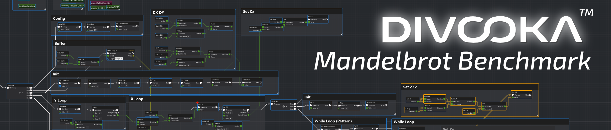

# Divooka Mandelbrot Benchmark

A benchmark for Divooka.

## Experiment Set

> Conclusion: A JIT (just-in-time compiler) is essential to any modern high performance scripting language.

**Setup**

Mandelbrot:

* Default 2000 x 2000, MaxIter = 1000, Runs = 5 (Correct output: 689833081)
* Exercises integer math, floating point, loops, branches, function calls, and memory writes
* Compare the printed checksum matches across all implementations

**Best Results**

|Rank (by Time)|Platform|Size|Run Time (Ms)|Peak Memory|
|-|-|-|-|-|
|1 (Tie)|JavaScript (Web/MS Edge)|3 KB|1,295.80 (No startup time)|≈9.54 MB|
|1 (Tie)|JavaScript (Web/Chrome)|3 KB|1,298.70 (No startup time)|≈9.54 MB|
|1 (Tie)|JavaScript (Web/Brave)|3 KB|1,302.80 (No startup time)|≈9.54 MB|
|2|C++|15 KB|1,308.00|18.62 MB|
|3|C# AoT|911 KB|1,355.35|17.98 MB|
|4|C# (.Net 10)|16.5 MB|1,357.47|26.88 MB|
|5|JavaScript (Node)|2 KB + 98.2 MB|1,406.20|49.47 MB|
|6|Go|2 KB + 224 MB|1,425.01|20.79 MB|
|7|Julia|2 KB + 1 GB|1,511.20|227.08 MB|
|8|JavaScript (Web/Firefox)|3 KB|1,513.00|N/A|
|9|Java (OpenJDK) (17.0.11)|2 KB + 2 KB + 301 MB|1,587.79|55.2 MB|
|10|Divooka (0.75.2; Compiled)|71.914 MB|3,639.24|47.46 MB|
|11|Divooka (0.75.2; Aviator Run)|8 KB + 2.16 GB (Distribution) + 776 MB (SDK)|6,710.84|145.61 MB|
|12|ChatGPT (5.3 Instant)|N/A|26,320.00|N/A|
|13|Python (3.13.5)|2 KB + 139 MB|47,127.70|61.4 MB|
|14|Ruby (3.2.2)|1 KB + 907 MB|49,489.82|52.45 MB|
|15|Prolog (SWI) (With optimization)|2 KB + 42.8 MB|314,687.84|12.67 MB|
|16|Kimi (2.6 Instant)|N/A|340,330.00|N/A|
|17|GNU Octave (7.3.0)|2 KB + 2.07 GB|2,464,913.29 (41 min)|5.46Mb|
|18|Divooka (0.75.2; Neo Editor)|8 KB + 2.67 GB|(Est.) 344,880,000 (95.8 Hr)|851 MB|
|19 (Tie)|Grok (Fast)|N/A|Failed|N/A|
|19 (Tie)|Gemini (Fast)|N/A|Failed|N/A|
|N/A|Haskell||||
|N/A|Julia||||
|N/A|Perl||||
|N/A|Elixir||||
|N/A|Pure 2||||
|N/A|Divooka (0.75.2; Stewer)||||
|N/A|Divooka (GP; Stewer)||||

Notes:

* Size refer to default distribution, which can typically be further optimized (e.g. embedded python, Divooka™ Compute)
* GenAI results are provided as it's of general interest in this AI age.

Observations:

* Damn JavaScript is fast.
* Python is surprisingly slow.
* GNU Octave is surprisingly slow.
* JavaScript is surprisingly fast.
* I know Octave is probably optimized for matrix operations - but raw iteration speed is 💩.
* Ruby.. oh my Ruby...
* GNU Octave seems very naive interpretation (but ues very little memory)?
* Modern scripting languages are not usable without JIT.

**Programming Languages Only**

(Filtered to languages/runtimes only. AI models removed. Ties condensed.)

| Rank | Language / Runtime                      |                 Size |          Run Time (ms) | Peak Memory |
| ---- | --------------------------------------- | -------------------: | ---------------------: | ----------: |
| 1    | JavaScript (Web: Edge / Chrome / Brave) |                 3 KB |      1,295.80–1,302.80 |    ≈9.54 MB |
| 2    | C++                                     |                15 KB |               1,308.00 |    18.62 MB |
| 3    | C# AoT                                  |               911 KB |               1,355.35 |    17.98 MB |
| 4    | C# (.NET 10)                            |              16.5 MB |               1,357.47 |    26.88 MB |
| 5    | JavaScript (Node.js)                    |       2 KB + 98.2 MB |               1,406.20 |    49.47 MB |
| 6    | Go                                      |        2 KB + 224 MB |               1,425.01 |    20.79 MB |
| 7    | Julia                                   |                 1 GB |               1,511.20 |   227.08 MB |
| 8    | JavaScript (Web: Firefox)               |                 3 KB |               1,513.00 |         N/A |
| 9    | Java (OpenJDK 17.0.11)                  | 301 MB + small files |               1,587.79 |     55.2 MB |
| 10   | Divooka 0.75.2 (Compiled)               |            71.914 MB |               3,639.24 |    47.46 MB |
| 11   | Divooka 0.75.2 (Aviator Run)            |     2.16 GB + 776 MB |               6,710.84 |   145.61 MB |
| 12   | Python 3.13.5                           |        2 KB + 139 MB |              47,127.70 |     61.4 MB |
| 13   | Ruby 3.2.2                              |        1 KB + 907 MB |              49,489.82 |    52.45 MB |
| 14   | Prolog (SWI, optimized)                 |       2 KB + 42.8 MB |             314,687.84 |    12.67 MB |
| 15   | GNU Octave 7.3.0                        |       2 KB + 2.07 GB | 2,464,913.29 (~41 min) |     5.46 MB |
| 16   | Divooka 0.75.2 (Neo Editor, est.)       |              2.67 GB | 344,880,000 (~95.8 hr) |      851 MB |

Notes:

* Fastest overall: JavaScript in browser.
* Fastest native binary: C++.
* Best managed runtime: C#.
* Divooka compiled lands mid-pack, beating Python, Ruby, Prolog, Octave by large margins.
* Divooka runtime/editor modes show tooling overhead rather than core language speed.

## Records

### 20260328

```
CPU       : 13th Gen Intel(R) Core(TM) i7-13700KF
Cores     : 16
Threads   : 24
RAM_GB    : 127.84
GPU       : NVIDIA GeForce RTX 4090
OS        : Microsoft Windows 11 Pro
OSVersion : 10.0.22631
```

**Run 1**

```
Name       Run ExitCode   TimeMs PeakMemoryMB
----       --- --------   ------ ------------
C++          1        0  2466.36         0.00
C++          2        0  2016.02         0.00
C++          3        0  2005.51         0.00
C++          4        0  2008.23         0.00
C++          5        0  2010.93         0.00
C# Trimmed   1        0  2113.89         0.00
C# Trimmed   2        0  2007.61         0.00
C# Trimmed   3        0  2008.79         0.00
C# Trimmed   4        0  2002.98         0.00
C# Trimmed   5        0  2005.13         0.00
C# AoT       1        0  2047.63         0.00
C# AoT       2        0  2015.38         0.00
C# AoT       3        0  2013.55         0.00
C# AoT       4        0  2005.27         0.00
C# AoT       5        0  2015.76         0.00
Python       1        0 53020.98         0.00
Python       2        0 51016.43         0.00
Python       3        0 48010.12         0.00
Python       4        0 48008.35         0.00
Python       5        0 53017.28         0.00

Summary:

Name       Runs AvgTimeMs MinTimeMs MaxTimeMs AvgPeakMemoryMB MaxPeakMemoryMB
----       ---- --------- --------- --------- --------------- ---------------
C# AoT        5   2019.52   2005.27   2047.63            0.00            0.00
C# Trimmed    5   2027.68   2002.98   2113.89            0.00            0.00
C++           5   2101.41   2005.51   2466.36            0.00            0.00
Python        5  50614.63  48008.35  53020.98            0.00            0.00
```

**Run 2**

```
Name       Run ExitCode   TimeMs PeakMemoryMB PeakMemoryKB
----       --- --------   ------ ------------ ------------
C++          1        0  1329.55        18.88     19336.00
C++          2        0  1323.36        18.57     19012.00
C++          3        0  1314.83        18.56     19004.00
C++          4        0  1332.19        18.56     19004.00
C++          5        0  1308.00        18.55     19000.00
C# Trimmed   1        0  1365.41        29.60     30308.00
C# Trimmed   2        0  1360.31        29.11     29804.00
C# Trimmed   3        0  1357.47        25.53     26140.00
C# Trimmed   4        0  1382.25        24.84     25440.00
C# Trimmed   5        0  1367.06        25.32     25932.00
C# AoT       1        0  1386.98        17.80     18232.00
C# AoT       2        0  1366.62        17.93     18356.00
C# AoT       3        0  1355.35        18.74     19192.00
C# AoT       4        0  1374.50        17.34     17756.00
C# AoT       5        0  1355.38        17.96     18388.00
Python       1        0 57932.10        61.42     62892.00
Python       2        0 53340.35        61.42     62896.00
Python       3        0 47127.70        61.39     62868.00
Python       4        0 47748.71        61.40     62876.00
Python       5        0 47256.38        61.39     62868.00


Summary:

Name       Runs AvgTimeMs MinTimeMs MaxTimeMs AvgPeakMemoryMB MaxPeakMemoryMB AvgPeakMemoryKB MaxPeakMemoryKB
----       ---- --------- --------- --------- --------------- --------------- --------------- ---------------
C++           5   1321.59   1308.00   1332.19           18.62           18.88        19071.20        19336.00
C# Trimmed    5   1366.50   1357.47   1382.25           26.88           29.60        27524.80        30308.00
C# AoT        5   1367.77   1355.35   1386.98           17.95           18.74        18384.80        19192.00
Python        5  50681.05  47127.70  57932.10           61.40           61.42        62880.00        62896.00
```

## 20260329

```
Name       Run ExitCode  TimeMs PeakMemoryMB PeakMemoryKB
----       --- --------  ------ ------------ ------------
Java         1        0 2172.38        54.81     56124.00
Java         2        0 1587.79        55.12     56444.00
Java         3        0 2170.23        54.94     56260.00
Java         4        0 2180.13        55.20     56520.00
Java         5        0 2161.38        54.95     56268.00
JS (Node)    1        0 1414.63        48.76     49932.00
JS (Node)    2        0 1408.87        50.67     51884.00
JS (Node)    3        0 1416.41        48.07     49224.00
JS (Node)    4        0 1421.06        49.81     51008.00
JS (Node)    5        0 1406.20        50.05     51248.00


Summary:

Name       Runs AvgTimeMs MinTimeMs MaxTimeMs AvgPeakMemoryMB MaxPeakMemoryMB AvgPeakMemoryKB MaxPeakMemoryKB
----       ---- --------- --------- --------- --------------- --------------- --------------- ---------------
JS (Node)     5   1413.43   1406.20   1421.06           49.47           50.67        50659.20        51884.00
Java          5   2054.38   1587.79   2180.13           55.00           55.20        56323.20        56520.00
```

```
Name         Run ExitCode    TimeMs PeakMemoryMB PeakMemoryKB
----         --- --------    ------ ------------ ------------
Go             1        0   1524.35        20.63     21124.00
Go             2        0   1430.81        21.00     21500.00
Go             3        0   1570.79        21.45     21960.00
Go             4        0   1437.50        20.39     20884.00
Go             5        0   1425.01        20.47     20960.00
Ruby           1        0  49693.17        52.45     53712.00
Ruby           2        0  49644.62        52.49     53748.00
Ruby           3        0  49489.82        52.48     53740.00
Ruby           4        0  49720.23        52.38     53636.00
Ruby           5        0  49634.29        52.44     53696.00
Prolog (SWI)   1        0 314687.84        12.66     12960.00
Prolog (SWI)   2        0 317327.18        12.68     12984.00
Prolog (SWI)   3        0 336952.45        12.66     12964.00
Prolog (SWI)   4        0 314983.90        12.67     12972.00
Prolog (SWI)   5        0 338078.59        12.68     12984.00


Summary:

Name         Runs AvgTimeMs MinTimeMs MaxTimeMs AvgPeakMemoryMB MaxPeakMemoryMB AvgPeakMemoryKB MaxPeakMemoryKB
----         ---- --------- --------- --------- --------------- --------------- --------------- ---------------
Go              5   1477.69   1425.01   1570.79           20.79           21.45        21285.60        21960.00
Ruby            5  49636.43  49489.82  49720.23           52.45           52.49        53706.40        53748.00
Prolog (SWI)    5 324405.99 314687.84 338078.59           12.67           12.68        12972.80        12984.00
```

## 20260330

```
Name       Run ExitCode     TimeMs PeakMemoryMB PeakMemoryKB
----       --- --------     ------ ------------ ------------
GNU Octave   1        0 2485694.66         5.50      5628.00
GNU Octave   2        0 2464913.29         5.45      5580.00
GNU Octave   3        0 2483131.48         5.45      5580.00
GNU Octave   4        0 2468400.16         5.44      5572.00
GNU Octave   5        0 2474652.51         5.45      5584.00


Summary:

Name       Runs  AvgTimeMs  MinTimeMs  MaxTimeMs AvgPeakMemoryMB MaxPeakMemoryMB AvgPeakMemoryKB MaxPeakMemoryKB
----       ----  ---------  ---------  --------- --------------- --------------- --------------- ---------------
GNU Octave    5 2475358.42 2464913.29 2485694.66            5.46            5.50         5588.80         5628.00
```

## 20260424

Divooka (Editor): 1252.223s for 2504172 iterations (Index: 840000); DRAM: 851MB. 
Estimated: (689833081 Iterations) 500.05µ/iter. 95.8Hr.

## 20260426

ChatGPT:

1. Run 1: 26.32s
2. Run 2: >3 mins (never replied, stuck on "working")

ChatGPT doesn't produce reliable outputs.

Gemini:

1. Run 1: "Something went wrong"
2. Run 2: 7.94s (Failed; Wrong output)

Grok:

1. Run 1: "No response. Grok was unable to finish replying."
2. Run 2: "No response. Grok was unable to finish replying."

Kimi:

1. Run 1: 340.33s (5 min 40.33s) (Through automatic tool use by executing Python Code; Tried twice automatically; First time encountered syntax error in its own generated code. Tried multiple times with variations.)

Notice through prompt engineering it's possible to fine tune AI's behavior (e.g. as it to use or not use tools), but we are relying on default behaviors for benchmark.

Because GenAI results are lengthy, not replicable, and contains lost of garbage, we chose not to include the transcripts and just record the final result. Some interesting results are available in `Scripts/GenAI/Prompt.md` - especially *Kimi's approach is interesting*. 

```
Name  Run ExitCode  TimeMs PeakMemoryMB PeakMemoryKB
----  --- --------  ------ ------------ ------------
Julia   1        0 1537.54       227.17    232620.00
Julia   2        0 1514.19       227.45    232908.00
Julia   3        0 1523.34       226.63    232072.00
Julia   4        0 1523.83       226.77    232208.00
Julia   5        0 1511.20       227.38    232840.00


Summary:

Name  Runs AvgTimeMs MinTimeMs MaxTimeMs AvgPeakMemoryMB MaxPeakMemoryMB AvgPeakMemoryKB MaxPeakMemoryKB
----  ---- --------- --------- --------- --------------- --------------- --------------- ---------------
Julia    5   1522.02   1511.20   1537.54          227.08          227.45       232529.60       232908.00
```

```
Name               Run ExitCode   TimeMs PeakMemoryMB PeakMemoryKB
----               --- --------   ------ ------------ ------------
Divooka (Aviator)    1        0 19066.15       153.90    157596.00
Divooka (Aviator)    2        0  6781.78       141.44    144836.00
Divooka (Aviator)    3        0  6797.91       145.53    149020.00
Divooka (Aviator)    4        0  6735.67       145.66    149156.00
Divooka (Aviator)    5        0  6710.84       141.52    144912.00
Divooka (Compiled)   1        0  3683.26        46.94     48068.00
Divooka (Compiled)   2        0  3649.01        48.62     49788.00
Divooka (Compiled)   3        0  3665.22        45.46     46548.00
Divooka (Compiled)   4        0  3639.24        47.11     48240.00
Divooka (Compiled)   5        0  3663.75        49.19     50372.00


Summary:

Name               Runs AvgTimeMs MinTimeMs MaxTimeMs AvgPeakMemoryMB MaxPeakMemoryMB AvgPeakMemoryKB MaxPeakMemoryKB
----               ---- --------- --------- --------- --------------- --------------- --------------- ---------------
Divooka (Compiled)    5   3660.10   3639.24   3683.26           47.46           49.19        48603.20        50372.00
Divooka (Aviator)     5   9218.47   6710.84  19066.15          145.61          153.90       149104.00       157596.00
```

## Limitations

The benchmark only tests simple loops and large integers:

* Other programs do not have special warm-up handling so JavaScript (web) has an advantage.
* There are a few loops but no recursion or deep function calls - Divooka may suffer when call hierarchy is deep.
* This tests raw native run time speed, but different programming systems have different uses - e.g. people rarely use Python as is.
* Certain languages are more suited for certain things. GNU Octave is supposedly very good at matrix.